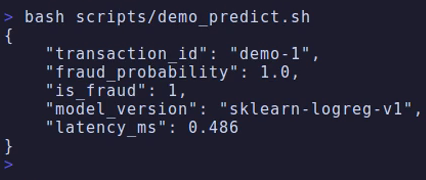
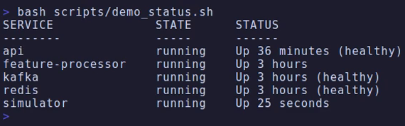
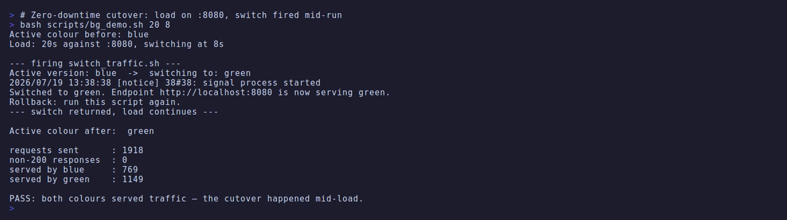

# Real-Time Fraud Detection — Technical Report

**Author:** Matthew Burns \
**Repository:** https://github.com/msburns24/real-time-fraud-detection \
**Date:** July 19, 2026

> Design rationale, failure modes and known limitations are developed at length
> in [`docs/architecture.md`](architecture.md); the deployment strategy in
> [`docs/blue_green_design.md`](blue_green_design.md). This report states the
> decisions and the evidence for them.

---

## Part A — Streaming Pipeline & Feature Store

### A1. System architecture

A transaction simulator publishes to Kafka; a feature processor consumes the
stream, maintains a rolling per-customer window, and writes aggregates to Redis;
a FastAPI service reads those aggregates, merges them with the incoming
transaction, and scores it.

```
 ┌───────────────┐  transactions   ┌───────────┐   consumer group    ┌────────────────────┐
 │   simulator   ├────────────────▶│   Kafka   ├────────────────────▶│ feature-processor  │
 │  (producer)   │ key=customer_id │  (broker) │ "feature-processor" │   rolling window   │
 │               │  3 partitions   │           │                     │                    │
 └───────────────┘                 └───────────┘                     └─────────┬──────────┘
                                                                               │
                                                        SET features:{customer_id} EX 48h
                                                                               │
   ┌────────┐   POST /predict    ┌───────────────────┐    GET/MGET   ┌─────────▼──────────┐
   │ client │ ──────────────────▶│   api (FastAPI)   │──────────────▶│       Redis        │
   │        │ ◀──────────────────│   merge + score   │◀──────────────│  (feature store)   │
   └────────┘   FraudPrediction  └───────────────────┘               └────────────────────┘
```

**Figure 1** — Transaction flow. The two halves communicate only through Redis.

**The defining decision is that feature computation is decoupled from serving.**
Nothing in the request path touches Kafka. The two workloads differ: scoring
needs bounded, predictable latency, while feature computation is stateful,
bursty and subject to consumer lag. Coupling them would merge the failure modes
— a broker hiccup would become a serving outage, and consumer lag would surface
as client latency. Separating them reduces the API's work to one Redis `GET`
plus one model call, **0.12 ms combined** (§P3).

The cost is **feature staleness**: the API serves features as of the processor's
last write, so a system needing read-your-writes consistency could not be built
this way. For 24-hour aggregates it is immaterial, and the transaction's own
attributes — which dominate the score — are always current. The decoupling also
yields the key resilience property: the store is consulted, not depended upon,
so its absence degrades accuracy rather than availability (§B1).

| Service             | Responsibility                                          |
| ------------------- | ------------------------------------------------------- |
| `simulator`         | Produces transactions; replays 24h backfill on start    |
| `kafka`             | Durable, replayable, partitioned transaction log        |
| `feature-processor` | Consumes the topic, maintains windows, writes to Redis  |
| `redis`             | Feature store — the interface between the two halves    |
| `api`               | Joins cached features with the request and scores it    |

**Table 1** — Service responsibilities.

Configuration resolves through one frozen `Settings` dataclass (`src/config.py`)
— every variable and default declared once, no scattered `os.getenv`. The single
exemption is the kit-provided `transaction_simulator.py`.

### A2. Topic and partition design

One topic, `transactions`, with **3 partitions** (replication factor 1, a
single-broker development constraint; production would use 3 with
`min.insync.replicas=2`).

Messages are **keyed by `customer_id`** (`transaction_simulator.py:88`, with a
`key_serializer` at `:52`), so the default partitioner hashes the key and routes
each customer's events to one partition. This is a correctness requirement, not tuning: the processor holds per-customer
window state **in memory**, so events split across consumers would each
aggregate half the data and overwrite one another in Redis — counts silently
wrong rather than visibly broken. Partitioning by key also caps parallelism at
the partition count and makes rebalances migrate whole customers.

```
GROUP             TOPIC         PARTITION  CURRENT-OFFSET  LOG-END-OFFSET  LAG  CONSUMER-ID
feature-processor transactions  1          14306           14306           0    kafka-python-…0ba113c8
feature-processor transactions  2          15503           15503           0    kafka-python-…0ba113c8
feature-processor transactions  0          18632           18632           0    kafka-python-…0ba113c8
```

**Figure 2** — `kafka-consumer-groups.sh --describe`, evidencing end-to-end
consumption.

Three things follow. **All three partitions are assigned to a single consumer**
— the `CONSUMER-ID` is identical on every row. **Lag is zero on each**, with
48,441 messages fully consumed. And **the offsets are uneven** (38.5 / 29.5 /
32.0 %), which is itself evidence that keying works: round-robin over a uniform
producer would trend toward equal counts, whereas hashing 200 discrete customer
keys into 3 buckets produces exactly this lumpiness. An even split would have
been the suspicious result.

### A3. Windowing

The window is **half-open** — `(at_time − window) < event_time ≤ at_time`.
Adjacent windows then partition time cleanly, so a boundary event belongs to
exactly one window; closed-closed bounds would double-count it, open-open would
drop it. Evaluation uses **event time**, which is what makes the 24-hour
backfill produce the same aggregates it would have produced live.

Aggregation lives in `windowed_stats()`, a pure function of
`(events, start, end)` — no I/O or state, so it is testable in isolation.

| Customer | Event time             | Amount | In window?                  |
| -------- | ---------------------- | ------ | --------------------------- |
| CUST0001 | `2025-12-31T23:00:00Z` | 999.0  | ✗ — before the window opens |
| CUST0001 | `2026-01-01T00:00:00Z` | 100.0  | ✓                           |
| CUST0001 | `2026-01-01T00:30:00Z` | 200.0  | ✓                           |
| CUST0001 | `2026-01-01T00:45:00Z` | 300.0  | ✓                           |
| CUST0002 | `2026-01-01T00:40:00Z` | 50.0   | ✓                           |

**Table 2** — Grading fixture, 1-hour window evaluated at `00:50:00Z`. Expected:
CUST0001 count 3 / avg 200.0; CUST0002 count 1 / avg 50.0.

The `999.0` event is the fixture's trap: aggregating full history instead of
filtering the window yields count 4 / avg **399.75** — plausible numbers that no
exception would reveal.

**Delivery semantics.** The consumer auto-commits (kafka-python default, 5 s
interval), so delivery is **at-least-once**. Each consequence is real and each
has a known fix:

| Hazard              | Effect                                                    | Fix |
| ------------------- | --------------------------------------------------------- | --- |
| Duplicate delivery  | `update()` appends unconditionally; no `transaction_id` dedup, so replays double-count | Bounded seen-ID set spanning the commit interval |
| Out-of-order event  | Evaluated at *its own* timestamp, so a late event overwrites fresher state with staler state | Evaluate at `max(seen_timestamp)` per customer |
| Restart / rebalance | Resumes from committed offset with an **empty** window, under-counting until refilled (`auto_offset_reset` does not help — it applies only with no committed offset) | Checkpoint state, or rewind one window on start |
| Malformed record    | Logged and skipped, keeping the consumer alive — effectively at-most-once for those | Dead-letter topic |

**Table 3** — At-least-once consequences and mitigations.

Note the **Redis write is idempotent** (`SET` overwrites) while the **in-memory
accumulation is not** — duplicates corrupt the aggregate, never the storage,
which is why the fix belongs in `update()`.

### A4. Feature store

One key per customer, `features:{customer_id}`, holding a JSON features dict.
A flat key-per-customer layout suits an access pattern that is purely point
lookup.

**TTL is atomic with the write** — `SET … EX`, not `SET` then `EXPIRE`. Two
commands can interleave with a failure and strand a key with no expiry; with
`ex=` that state is structurally unreachable. TTL is 48 h against a 24 h window,
so features outlive the window and a processor outage decays gracefully rather
than falling straight to cache misses.

**Batch retrieval is one round-trip.** IDs are de-duplicated, a single `MGET`
issued, and results zipped back by MGET's ordering guarantee (empty input
short-circuits, since a zero-key `MGET` is an error). Verified behaviourally:
after `CONFIG RESETSTAT`, a 5-transaction batch over 3 customers yields
**`cmdstat_mget: calls=1` and no `cmdstat_get` at all**.

Connections are pooled per `(host, port, password)`. One detail fails silently:
redis-py **ignores connection kwargs on the client when a pool is supplied**, so
`decode_responses=True` must be set on the *pool* — otherwise values return as
`bytes` and `json.loads` fails far from the mistake.

| Run       | mean | p50  | p95  | p99  | max  |
| --------- | ---- | ---- | ---- | ---- | ---- |
| 1 (cold)  | 0.13 | 0.10 | 0.32 | 0.50 | 1.00 |
| 2–4 (warm)| 0.04 | 0.03–0.07 | **0.04–0.09** | 0.04–0.11 | 0.14–0.36 |

**Table 4** — Retrieval latency, ms, n=1000 reads per run.

**Steady-state p95 is 0.04–0.09 ms**, three orders of magnitude under the 50 ms
requirement. Run 1 is reported rather than discarded: its inflated p95 is the
pool opening its first socket lazily, and hiding it would conceal that the first
request after a process start genuinely is slower. These cover single-key `GET`
over loopback — batch is cheaper per customer, and a networked Redis would add a
round-trip dominating this entirely.

### A5. Links to implementation

| What                       | Where                                                                 |
| -------------------------- | --------------------------------------------------------------------- |
| Windowed aggregation       | [`feature_processor.py` › `windowed_stats()`](../src/streaming/feature_processor.py#L53) |
| Consumer loop              | [`feature_processor.py` › `run()`](../src/streaming/feature_processor.py#L114) |
| Producer keying            | [`transaction_simulator.py` › `_send()`](../src/streaming/transaction_simulator.py#L88) |
| Atomic-TTL write           | [`feature_store.py` › `store_customer_features()`](../src/streaming/feature_store.py#L63) |
| Batch retrieval            | [`feature_store.py` › `get_customer_features_batch()`](../src/streaming/feature_store.py#L80) |
| Connection pooling         | [`feature_store.py` › `_get_pool()`](../src/streaming/feature_store.py#L26) |
| Configuration              | [`config.py` › `Settings`](../src/config.py#L16)                        |
| Windowing fixture          | [`window_fixture.json`](../tests/fixtures/window_fixture.json)          |

**Table 5** — Part A implementation index.

---

## Part B — Model Serving & Containerization

### B1. API design and endpoints

| Method | Path             | Purpose                                                     |
| ------ | ---------------- | ----------------------------------------------------------- |
| `GET`  | `/health`        | Liveness probe; backs the container `HEALTHCHECK`            |
| `GET`  | `/model/info`    | Reports the loaded model version                            |
| `POST` | `/predict`       | Scores a single transaction                                 |
| `POST` | `/predict_batch` | Scores a list, retrieving all features in one Redis command |

**Table 6** — API surface.



**Figure 5** — A scored transaction: $4,000 online against a customer whose
recent average is ~$125, returning `fraud_probability: 1.0` in 0.49 ms.

**Validation is schema-driven.** `Transaction` and `FraudPrediction` are Pydantic
models, so FastAPI rejects malformed input at the boundary with HTTP 422 and a
machine-readable body — verified for both a missing field and a wrong type. The
same declaration drives request parsing, the 422 responses and the OpenAPI
document at `/docs`, so they cannot drift apart.

**The model is loaded once**, at module scope (`main.py:26`). The cost avoided
was measured: the first `joblib.load` takes **≈470 ms** — mostly importing
scikit-learn's unpickling machinery — and later loads **0.11 ms**. Per-request
loading would make each container's first request absorb 470 ms and every later
one still pay 0.11 ms (17% of a 0.63 ms p50) for invariant work;
`--start-period=10s` covers the startup cost. `/model/info` returns
`sklearn-logreg-v1`, confirming the trained artifact, not the fallback.

`/predict` retrieves features, merges, scores and times the whole path.
**Transaction fields win on collision** — cached features summarise history,
while the transaction describes the event being scored. `/predict_batch`
de-duplicates customer IDs, issues one `MGET`, and returns predictions in
request order; each item's `latency_ms` is measured from batch start, so it means
"elapsed when this prediction became available".

**Redis failure degrades rather than propagates.** Lookups catch
`redis.RedisError` *specifically* — a bare `except` would turn every programming
error into a plausible-looking prediction — log a warning, and score on the
transaction alone. With Redis stopped, the suite passes and both endpoints
return 200.

**Timeouts make this fast rather than merely correct.** A *refused* connection
fails instantly, so stopping the container makes a naive implementation look
resilient; a *blackholed* host would block indefinitely, since redis-py leaves
socket timeouts unset. With both timeouts at 1 s, `/predict` against an
unroutable address returns in **1.02 s**. Testing only the easy failure would
have shipped something that looked robust and was not.

Each request logs `customer_id`, `latency_ms`, `fraud_probability` and a
`degraded` flag as bound structured fields. **Known limitation:** `degraded` is
derived from `stored is None`, which is true for both a Redis error *and* an
ordinary cache miss — so an unknown customer is logged as degraded even when
Redis is healthy. The flag reliably indicates features were *absent*, not that
Redis was *unavailable*, and should not be used to alert on store health.

### B2. Containerization

A multi-stage build: the builder installs under `--prefix=/install` and the
runtime copies that tree to `/usr/local`, which works because that is where the
runtime image's `site-packages` lives. Getting it wrong yields an image that
builds cleanly and dies at first import — so the build was verified by importing
the real dependency graph *inside* the container.

`.dockerignore` excludes `.venv/`, `.git/`, caches, `logs/` and `.env`, keeping
the build context at **1.1 MB** — the virtualenv alone is **537 MB**. Excluding
`.env` is a security property: it keeps credentials out of image layers, where
they survive later deletion.

The image runs as non-root. `chown` runs **before** `USER`, so `/app` is owned
by the account that runs the process; `docker inspect` confirms `User=appuser`.

The health check uses `python -c "import urllib.request…"` rather than `curl`,
because **`python:3.11-slim` ships no `curl`** — the conventional probe would
fail with "command not found" and report `unhealthy` forever while the service
served traffic normally.



**Figure 4** — `docker compose up` brings up all five services.

Compose gates application services on `depends_on: service_healthy`, not
`service_started` (which asserts only that a container was created). One
subtlety: `feature-processor` and `simulator` share the image and inherit its
HTTP health check despite serving no HTTP, so both set
`healthcheck: { disable: true }` — otherwise a `service_healthy` dependency on
them would deadlock.

### B3. Blue-green deployment

`api-blue` and `api-green` run simultaneously behind nginx, built from the same
image and sharing Redis, so they differ only in version. Exactly one upstream
`server` line is active. Clients use the stable `:8080`; each colour is also
reachable directly on `:8001` / `:8002`.

`switch_traffic.sh` detects the current colour by grepping the config (state
lives in the config, so it cannot disagree with reality), **health-gates the
target on its direct port**, flips the lines, then reloads nginx. The direct
port is load-bearing: probing `:8080` would confirm only that the *active*
version is healthy. Because the gate runs before the config is touched, under
`set -euo pipefail`, a target that fails to start yields a failed *deployment*,
not an outage. **Rollback is the same command**, so that path cannot rot.

`nginx -s reload` keeps the listening socket open and forks new workers while
old ones drain. Keep-alive connections are **not** pinned to draining workers —
those close idle connections and clients reconnect onto the new colour.



**Figure 3** — `scripts/bg_demo.sh`: 20 s of continuous load against `:8080`
with the switch fired at 8 s.

| Measurement          | Run A (green → blue) | Run B (blue → green, rollback) |
| -------------------- | -------------------- | ------------------------------ |
| Requests sent        | 1,559                | 1,918                          |
| Non-200 responses    | **0**                | **0**                          |
| Served by blue       | 971                  | 769                            |
| Served by green      | 588                  | 1,149                          |

**Table 7** — Two cutovers under continuous load, in opposite directions.

Run B is the rollback: re-running the same script switched back, confirming the
rollback path works and is not merely asserted. **The per-colour counts are the
proof, not the error count** — both being non-zero can only be produced by
traffic actually moving mid-run.

An earlier, longer run through the harness measured p50 1.14 / p95 3.28 / p99
4.78 ms at 720 req/s with **1 error in 60,000** (0.002%) — the keep-alive close
race described above, corroborated by an independent new-connection probe seeing
0 failures in 140 requests.

#### B3.1 A silent failure in the provided switch script

The first three cutover runs appeared to succeed and did not. The script printed
`Switched to green`, nginx reloaded cleanly, the host config showed the new
state, and the harness reported zero errors. Traffic never moved.

`sed -i` is not in-place: it writes a temporary file and renames it, producing a
**new inode** (demonstrated: `2238265` → `2238266`). The compose file
bind-mounts `nginx.conf` as a *single file*, and single-file mounts bind the
**inode**, not the path — so the rename detached the container's view and nginx
reloaded the original, unchanged file. Every layer was correct in isolation,
which is why it was invisible. Fixed by rewriting the original inode
(`cat "$CONF.tmp" > "$CONF"`); recovery also needed `--force-recreate nginx`,
since the running mount still resolved to the orphaned inode.

The deeper failure was that the verification could not detect the bug.
`errors: 0` is consistent with success, with a mistimed switch, *and* with no
switch at all — so it distinguishes nothing. Per-colour counts have a signature
no failure mode can fake. **Verify the effect, not the actuator.**

### B4. Links to implementation

| What                       | Where                                                              |
| -------------------------- | ------------------------------------------------------------------ |
| Startup model load (once)  | [`main.py` › module scope](../src/api/main.py#L26)                  |
| `/predict`                 | [`main.py` › `predict_fraud()`](../src/api/main.py#L93)             |
| `/predict_batch`           | [`main.py` › `predict_fraud_batch()`](../src/api/main.py#L115)      |
| Graceful degradation       | [`main.py` › `lookup_features()`](../src/api/main.py#L58)           |
| Scoring + fallback         | [`fraud_detector.py` › `predict()`](../src/api/fraud_detector.py#L42) |
| Multi-stage image          | [`Dockerfile`](../Dockerfile)                                       |
| Service orchestration      | [`docker-compose.yml`](../docker-compose.yml)                       |
| Cutover script             | [`switch_traffic.sh`](../deployment/switch_traffic.sh)              |

**Table 8** — Part B implementation index.

---

## Performance

### P1. Method

Figures come from the provided harness with its fixed seed (789):

```bash
python tests/test_performance.py --n 5000 --url http://localhost:8000
```

**`--n 5000`, not the default 1000** — at ~1,500 req/s, 1,000 requests is under
a second of sampling, too short for a stable p99 and dominated by startup.

**Requests are cache hits, verified not assumed.** The simulator creates
`CUST0000`–`CUST0199` and the harness draws the same range, so every request
exercises the full lookup → merge → score path, not the cache-miss shortcut.

**The harness is sequential**, so `throughput_rps` is the reciprocal of mean
latency, not concurrent capacity. Concurrency-oriented changes (async Redis,
more workers) would therefore register as no improvement — which is why §P4
targets per-request work. Every figure below is a median of repeated runs.

### P2. Results

| Metric     | Result     |
| ---------- | ---------- |
| Requests   | 5000       |
| Errors     | **0**      |
| Throughput | 1023 req/s |
| p50        | 0.63 ms    |
| p95        | 2.97 ms    |
| p99        | 3.95 ms    |
| max        | 6.51 ms    |

**Table 9** — Load-test results (`results.json`), direct to the API with the
transaction stream live. This is the median run of five; the figures quoted are
that run's, so the committed artifact and this table are the same measurement
rather than a per-metric composite. Spread across the five: 681–1178 req/s,
p95 2.37–3.85 ms, **zero errors in all five**.

**p95 of 2.97 ms against the 100 ms requirement is roughly 34× headroom.**

**On measurement conditions.** That spread is wide, and worth stating plainly
rather than hiding behind a median. Throughput varies by ~1.7× run to run on an
otherwise idle developer machine, so any single figure here should be read as an
order of magnitude, not a benchmark. Two conditions were measured separately:
with the simulator producing (above) and with it stopped, which gives 1234 req/s
and p95 2.71 ms. The live-stream numbers are quoted as the headline because a
continuously fed stream is the system's intended operating condition, and it is
the more conservative of the two. Earlier drafts of this report cited 1497 req/s
and p95 1.42 ms from a quieter machine; those were not reproducible across
thirteen runs today and have been replaced rather than kept because they
flattered the result.

§B3's blue-green figures (p50 1.14 / p95 3.28 at 720 req/s) are worse on every
axis because that run went **through the nginx proxy**, whereas Table 9 is
direct to `:8000`. The difference is the proxy hop, not a regression.

### P3. Bottleneck analysis

**Hypothesis: scikit-learn inference dominates** — it is the only numerically
intensive step, and `predict_proba` validates input on every call.

| Stage            | p50 (ms)   |
| ---------------- | ---------- |
| Input validation | 0.0049     |
| Redis `GET`      | 0.0494     |
| Merge            | 0.0006     |
| Model inference  | 0.0663     |
| Logging          | 0.0215     |
| **Total**        | **0.1427** |

**Table 10** — Per-stage cost, in-process, n=2000.

**Falsified.** Inference is the largest application term, but the *entire*
application is 0.143 ms of a 0.552 ms request. Driving inference to zero would
gain about 12%.

Benchmarking `/health` — which parses no body and touches no dependency —
isolates the floor imposed by client, loopback and baseline framework handling:

```
0.552 ms  /predict (median of 5 × 4000 requests)
−0.241 ms  transport + framework floor (/health)   44%
−0.143 ms  application work (Table 10)             26%
─────────
 0.168 ms  endpoint-specific framework cost        30%
```

**The system is framework-bound, not compute-bound.** Redis contributes 0.049 ms
and inference 0.066 ms; well over half the request is transport and framework
machinery no application change can reach.

### P4. The optimization attempted

**Hypothesis.** FastAPI validates the response twice: the handler constructs a
`FraudPrediction`, and `response_model=FraudPrediction` then re-validates that
finished object against the model that produced it. Declaring
`response_model=None` removes the second pass. An early measurement put the
`/predict`-minus-`/health` gap at 0.509 ms and suggested this was the dominant
term.

**Method.** The container was rebuilt for each variant and both were measured
with the *same* paired benchmark — 3 × 4000 requests against `/health` and
`/predict` per build — comparing the **gap**, so machine drift affects both
terms equally.

| Build                              | `/health` p50 | `/predict` p50 | gap          |
| ---------------------------------- | ------------- | -------------- | ------------ |
| Baseline (`response_model=Fraud…`) | 0.243 ms      | 0.517 ms       | **0.269 ms** |
| Optimized (`response_model=None`)  | 0.237 ms      | 0.538 ms       | **0.297 ms** |

**Table 11** — A/B comparison of the response-validation change.

**The hypothesis is not supported.** Removing response validation produced no
measurable improvement — the optimized build measured marginally slower, within
run-to-run variation. The load harness could not resolve any difference either
(overlapping throughput ranges); given the ~1.7× run-to-run spread documented in
§P2, it never could have — the effect being sought was far smaller than the
noise floor of the instrument used to look for it.

**Why the original estimate was wrong is the more useful finding.** The 0.509 ms
gap came from a single measurement taken earlier under different machine load.
Re-measuring the baseline immediately alongside the optimized build gave
0.269 ms, and the entire apparent saving disappeared with it. The change had
been credited with drift between two measurement sessions. **A difference
measured across time is not an A/B test** — the same failure shape as §B3.1,
where a metric consistent with several realities was read as evidence for one.

**Decision: reverted.** With no latency benefit the trade is pure cost —
`response_model=None` removes `/predict`'s schema from the OpenAPI document for
nothing in return. The remaining 0.168 ms is genuine framework overhead but
*distributed* across body parsing, dependency resolution, validation and
serialisation, not concentrated in one removable component — which is precisely
why the flag did nothing. Reducing it further would need a different framework
or serialisation strategy; at ~34× headroom there is no case for that.

---

## Appendix — Defects found in the provided infrastructure

Three latent defects surfaced during integration. All three **failed silently**,
presenting as a healthy system while something essential did not work.

| Defect                                       | What looked fine          | What actually exposed it              |
| -------------------------------------------- | ------------------------- | ------------------------------------- |
| Kafka health check ran `kafka-topics.sh` off `PATH` (scripts live in `/opt/kafka/bin`) | Broker served traffic normally | `service_healthy` never satisfied |
| `offsets.topic.replication.factor=3` on a single broker, so `__consumer_offsets` could not be created and no consumer group could form | Producer wrote 9,600 messages successfully | `__consumer_offsets` absent; Redis stayed empty |
| `sed -i` replaced the bind-mounted config's inode (§B3.1) | Script reported success; nginx reloaded | Per-colour request counts |

**Table 12** — Silent failures and the evidence that exposed them.

The second requires `docker compose down -v` after the fix, since the broker
persists the original replication factor in its metadata and a plain restart
retains the broken setting.

The practice this project settled on is to verify the observable *consequence*
rather than a mechanism's self-report — a key written by one service and read by
another, dependencies imported inside a built image, request counts on both
sides of a cutover. That discipline is why §P4 reports a refuted hypothesis
rather than a convenient improvement.
