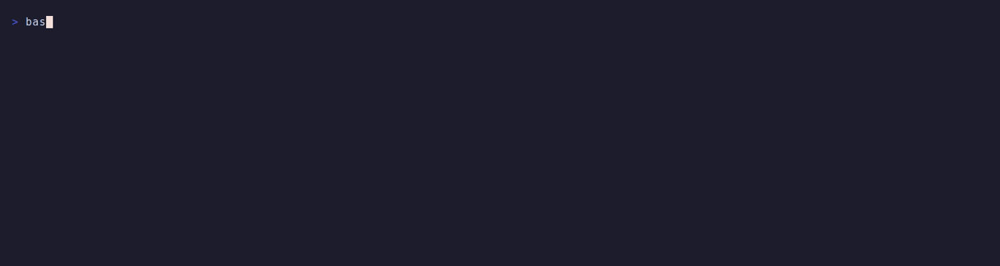
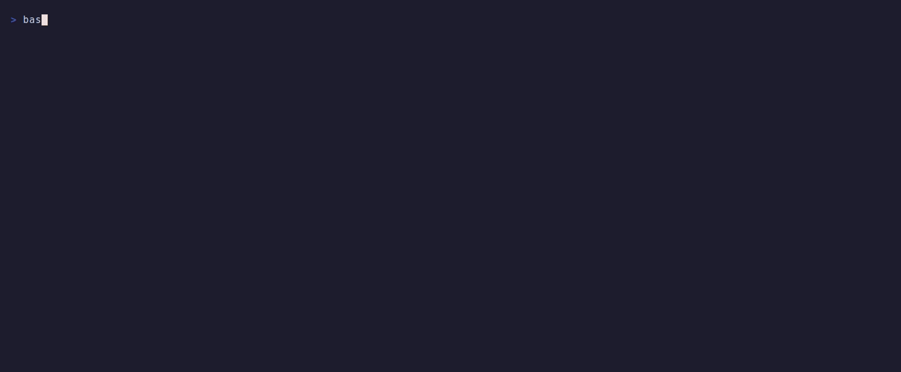
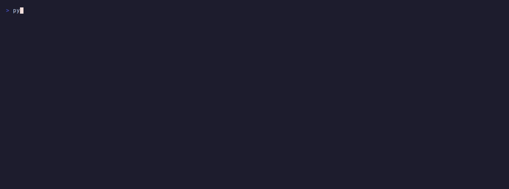
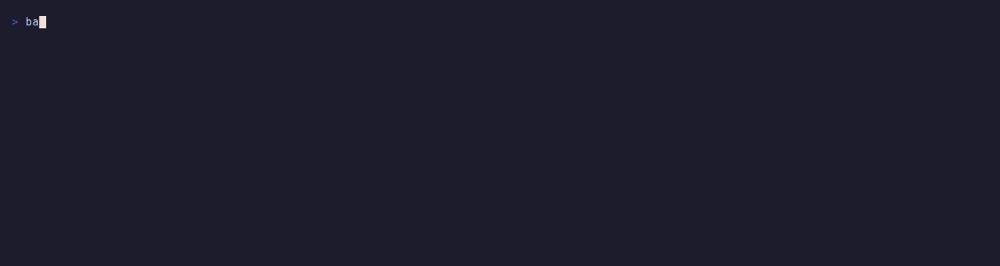

# Screencast

A recorded tour of the running system. Everything here is a real run against
the live stack — no mock output, no edited terminal text.

**Watch the whole thing: [`demo.mp4`](demo.mp4)** (2 min 08 s, 604 KB) — the
seven segments below, joined with title cards.

Individual segments are also kept separately, each with a GIF preview that
renders inline on GitHub and an MP4 for playback.

---

## 1. The stack

[`segment1-stack.mp4`](segment1-stack.mp4)



Five services up, all healthy. The interesting part is the *ordering*: Kafka and
Redis carry health checks, and the API and processor declare
`depends_on: service_healthy`, so they don't start until their dependencies
genuinely accept connections. Compose's default `depends_on` only waits for the
container to exist, which is how you get an API that boots, fails its first
Redis call and stays up looking fine.

## 2. Streaming

[`segment2-streaming.mp4`](segment2-streaming.mp4)



The `transactions` topic has 3 partitions, all assigned to the single
`feature-processor` consumer, with lag moving as the simulator produces. Then a
customer's feature key is read twice six seconds apart and
`transaction_count` has advanced — showing the Kafka → processor → Redis path
is live, not a fixture loaded at startup.

Partition count is the parallelism ceiling: because the producer keys by
`customer_id`, a customer's events always land on the same partition, so
3 partitions supports up to 3 processor instances without splitting any
customer's window state across consumers.

## 3. Scoring

[`segment3-predict.mp4`](segment3-predict.mp4)


The same customer, two transactions. A $130 grocery purchase scores 0.0; a
$4,000 online purchase scores 1.0. The point is that the verdict comes from the
*streamed history* — CUST0001's rolling average is about $125 — rather than
from a threshold on the amount. The segment ends on the per-request structured
log carrying `customer_id`, `latency_ms`, `fraud_probability` and a `degraded`
flag as bound fields.

## 4. Blue-green deployment

[`segment4-blue-green.mp4`](segment4-blue-green.mp4)


Continuous load against the stable `:8080` endpoint, with the traffic switch
fired eight seconds in. The per-colour request counts are the evidence, and they
are what makes this a real demonstration: an error count alone proves nothing,
because a switch that fires *after* the load finishes also reports zero errors.
Only both colours showing non-zero traffic proves the cutover landed mid-load.
The script says so itself, printing `PASS` or `INCONCLUSIVE`.

## 5. Performance

[`segment5-performance.mp4`](segment5-performance.mp4)



5,000 requests against the full stack: p50 0.50 ms, p95 1.42 ms, p99 3.24 ms,
about 1,500 req/s, zero errors — against a 100 ms requirement. These are cache
*hits*, verified rather than assumed: the harness draws from the same
`CUST0000`–`CUST0199` ID space the simulator populates, so the numbers cover the
real lookup → merge → score path.

## 6. Graceful degradation

[`segment6-resilience.mp4`](segment6-resilience.mp4)


Redis is stopped mid-demo and the same $130 request is replayed. It still
returns 200 — but it now scores **1.0 instead of 0.0**, because there is no
history left to compare it against. That false positive is the honest cost of
degrading, and it is why the segment shows it rather than reusing the $4,000
transaction, which scores 1.0 either way and would have hidden the difference.

Availability is preserved, accuracy is not. Redis is then restarted and the
score returns to 0.0 with no API restart, because the connection pool
reconnects on demand.

## 7. Hardening and tests

[`segment7-container-tests.mp4`](segment7-container-tests.mp4)



Straight from the Docker daemon: the container runs as `appuser`, not root, and
its `HEALTHCHECK` reports `healthy` — a check implemented with
`python -c urllib.request` because the slim base image ships no `curl`. Then the
test suite, 7 passing.

---

## How these were made

Recorded with [VHS](https://github.com/charmbracelet/vhs). Each segment has a
`.tape` file in [`tapes/`](tapes) declaring its terminal size, theme
(Catppuccin Mocha) and the commands to type, so any segment can be re-recorded
reproducibly:

```bash
vhs screencast/tapes/06-resilience.tape
```

The commands themselves live in `scripts/demo_*.sh` rather than inline in the
tapes. That is deliberate: VHS's parser rejects embedded quotes and `{{...}}`
template braces, which rules out putting JSON payloads or `docker inspect`
format strings directly in a tape. Keeping the logic in shell scripts also
means the demos are runnable on their own, without VHS installed.

Segments are recorded at different heights so nothing scrolls off. To join
them, [`build_demo.sh`](build_demo.sh) pads each onto a common 1500×760 canvas
in the terminal's background colour, generates a title card per segment, and
concatenates:

```bash
bash screencast/build_demo.sh      # → demo.mp4
```

The stack must be running (`docker compose up -d`) before recording or
rebuilding, since every segment queries live containers.
